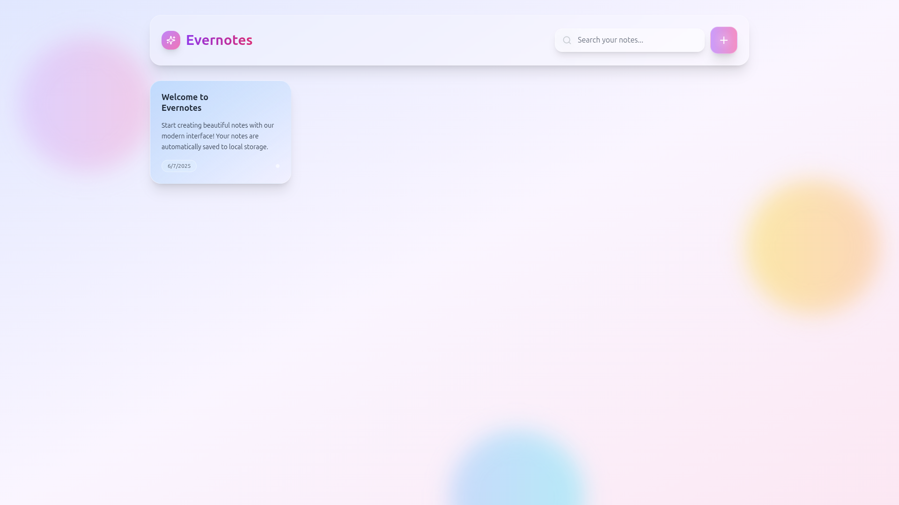

# 📝 Evernotes

**Evernotes** is a lightweight and user-friendly note-taking app that allows users to easily create, edit, and delete notes. It is entirely frontend-based and does not require any backend server.



## 🔧 Features

- Create, edit, and delete notes.
- Save data using local browser storage.
- Responsive and user-friendly interface.
- No backend server required.

## 🛠️ Tech Stack

- **React.js** — For building the user interface.
- **Tailwind CSS** — For styling.
- **LocalStorage** — For saving data in the browser.

## 📦 Installation and Running

### For Local Running:

1. Clone the repository:

   ```bash
   git clone https://github.com/Bhavin-Pathak/evernotes.git
   cd evernotes
   ```

2. Install dependencies:

   ```bash
   npm install
   ```

3. Start the development server:

   ```bash
   npm start
   ```

4. Open in your browser: [http://localhost:3000](http://localhost:3000)

## 📞 Support

If you have any questions or need help, please:

1. Check the [Issues](https://github.com/Bhavin-Pathak/evernotes/issues) page
2. Create a new issue if your problem isn't already reported
3. Contact: bhavinpathak29@gmail.com

## 📄 License

This project is licensed under the MIT License - see the [LICENSE](LICENSE) file for details.

## 🤝 Contributing

1. Fork the repository
2. Create your feature branch (`git checkout -b feature/AmazingFeature`)
3. Commit your changes (`git commit -m 'Add some AmazingFeature'`)
4. Push to the branch (`git push origin feature/AmazingFeature`)
5. Open a Pull Request
6. Follow React best practices
7. Use functional components with hooks
8. Write clean, commented code
9. Add tests for new features
10. Update documentation

## ⭐ If you found this project helpful, please give it a star!
